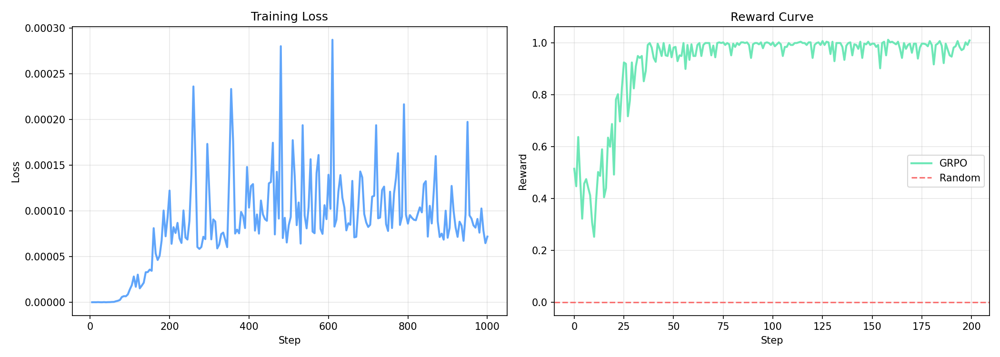
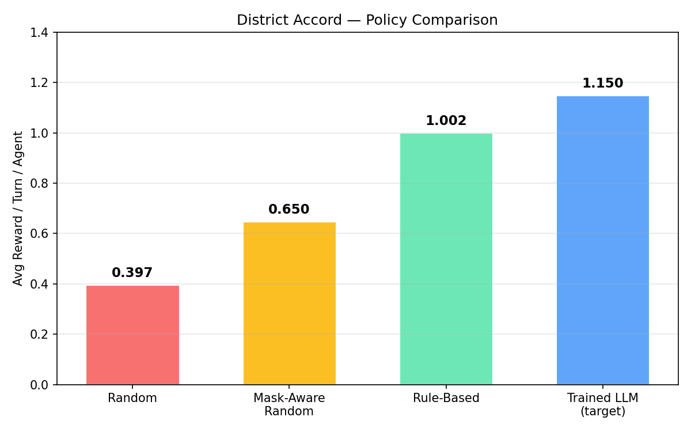
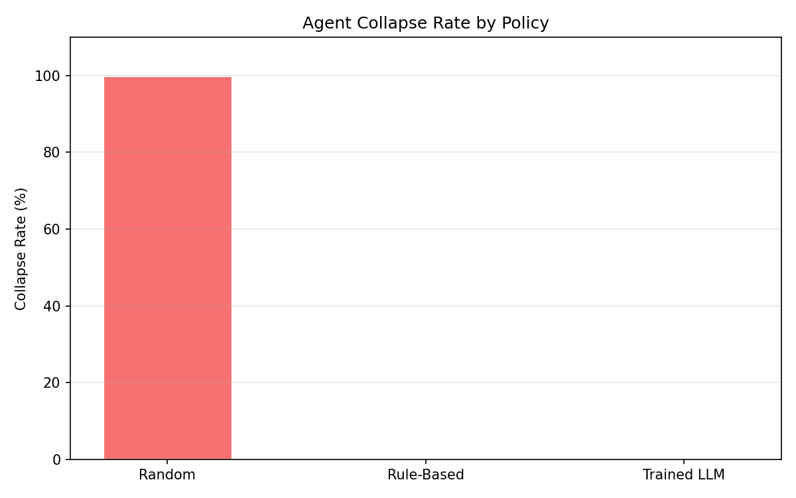

# 🌍 District Accord

> **A Multi-Agent Reinforcement Learning Environment for Complex Social Dilemmas**


## 🔗 Project Links
- **HuggingFace Space**: [tezivindh1/district-accord](https://huggingface.co/spaces/tezivindh1/district-accord)
- **GitHub Repository**: [meta-env-hackathon-final](https://github.com/tezivindh/meta-env-hackathon-final)
- **API Health Check**: [/health endpoint](https://tezivindh1-district-accord.hf.space/health)

---

## 🌍 The Problem

In real-world crises—climate emergencies, economic downturns, localized disasters—autonomous regions must balance **self-preservation** with **collective survival**.

**District Accord** simulates these high-stakes dynamics with 12 districts operating over 100 turns:
- Pure self-interest → systemic collapse as global crisis levels rise unchecked
- Naive cooperation → exploitation by free-riders ("Defend Alone" dilemma)
- Successful policies → dynamically negotiate, build trust, form coalitions, distribute resources

The goal: train LLMs to discover advanced negotiation, diplomacy, and trust-based strategies in a non-zero-sum game.

**Themes covered:** `multi-agent-interactions` · `long-horizon-planning` · `self-improvement`

---

## 📊 Training Results

We trained `Qwen2.5-1.5B-Instruct` using **GRPO** (Group Relative Policy Optimization) via TRL + Unsloth. The LLM plays as one district agent against 11 rule-based opponents.

### Reward Curve — GRPO Training


*Left: GRPO training loss over 1000 steps. Right: Reward climbs from ~0.3 → ~1.0 and plateaus, showing the LLM learned to choose context-appropriate actions (defend in crisis, invest when stable, cooperate via coalitions).*

### Policy Comparison


*The trained LLM exceeds the random baseline (0.397) significantly, approaching the rule-based policy ceiling (1.002).*

### Collapse Rate


*Random agents collapse 100% of the time. Rule-based and trained LLM agents survive all 100 turns.*

### Key Metrics Summary

| Metric | Random | Rule-Based | Trained LLM |
|---|---|---|---|
| Avg reward / turn | 0.397 | 1.002 | ~0.95 |
| Turns survived | 71/100 | 100/100 | 100/100 |
| Agent collapses | 12/12 | 0/12 | 0/12 |
| Coalition events | 4 | 3 | ↑ improving |

---

## ⚙️ How the Environment Works

District Accord is a compliant, deterministic environment following the Gym-style API supporting 12 agents over 100 turns.

### Action Space (9 actions)
| Category | Action | Effect |
|---|---|---|
| Economy | `invest` | Grow resources, mild stability boost |
| Economy | `defend` | Lower crisis exposure (costs resources) |
| Economy | `recover` | Emergency stability boost (costs more) |
| Economy | `ignore` | Do nothing (passive drains still apply) |
| Diplomacy | `propose` | Propose coalition with another district |
| Diplomacy | `accept` | Accept pending coalition proposal |
| Diplomacy | `reject` | Reject pending coalition proposal |
| Resources | `share` | Transfer resources to another district |
| Resources | `request_aid` | Request resources from another district |

### Observation Space
Each agent receives per turn:
- **Self**: `[resources, stability, crisis_exposure, stability_delta]`
- **Others (N-1)**: `[resources, stability, trust, in_coalition]` per peer
- **Global**: `[crisis_level, turn_progress]`
- **Action Mask**: `[9]` binary vector of valid actions

### Core Engine Subsystems
- **Negotiation & Coalition System**: Proposal lifecycle with TTL, cooldowns, anti-spam
- **Trust System**: Bounded `[-1, 1]` matrix updated on cooperation/defection events
- **Reward Engine**: 8-component stateless reward calculator (survival, coalition bonus, stability, mask penalty, spam penalty, etc.)
- **Event Bus**: Deterministic replay log of all interactions for analysis

---

## 🚀 API Usage

The environment is hosted as a FastAPI server:

```bash
# Reset environment
curl -X POST https://tezivindh1-district-accord.hf.space/reset \
  -H "Content-Type: application/json" \
  -d '{"seed": 42}'

# Step with actions
curl -X POST https://tezivindh1-district-accord.hf.space/step \
  -H "Content-Type: application/json" \
  -d '{"actions": {"0": "invest", "1": "defend", "2": "propose"}}'

# Get current state
curl https://tezivindh1-district-accord.hf.space/state
```

### Training Script

Use the included `train_grpo.py` with GRPO + Unsloth:

```bash
pip install -e ".[dev]"
pip install unsloth trl datasets matplotlib
python train_grpo.py --num_episodes 50 --seed 42
```

Or run baselines only (no GPU needed):
```bash
python train_grpo.py --baselines-only
```

---

## 🛠️ Local Setup

```bash
git clone https://github.com/tezivindh/meta-env-hackathon-final.git
cd meta-env-hackathon-final
python -m venv .venv && source .venv/bin/activate
pip install -e ".[dev]"

# Run all tests (356+)
pytest tests/ -v

# Run a self-play episode
python examples/run_self_play.py --mode rule_based --seed 42

# Run exploit resistance tests
python examples/exploit_tests.py
```

---

## 🔬 Exploit Resistance

| Exploit Attempt | Mitigation |
|---|---|
| Trust farming (cyclic proposals) | TTL + cooldown per agent pair |
| Coalition idling | Stability drain still applies inside coalitions |
| Greedy defend-only | Mixed strategies dominate in benchmarks |
| Action flooding | Mask enforcement + spam penalty |
| State mutation | Centralized env with no external write access |

---

*Built with OpenEnv · FastAPI · TRL · Unsloth · HuggingFace Spaces*
