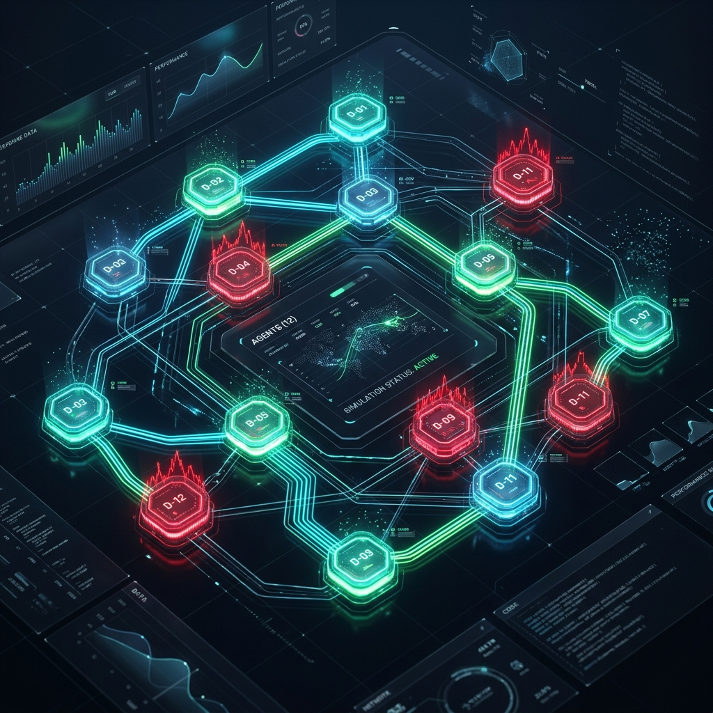
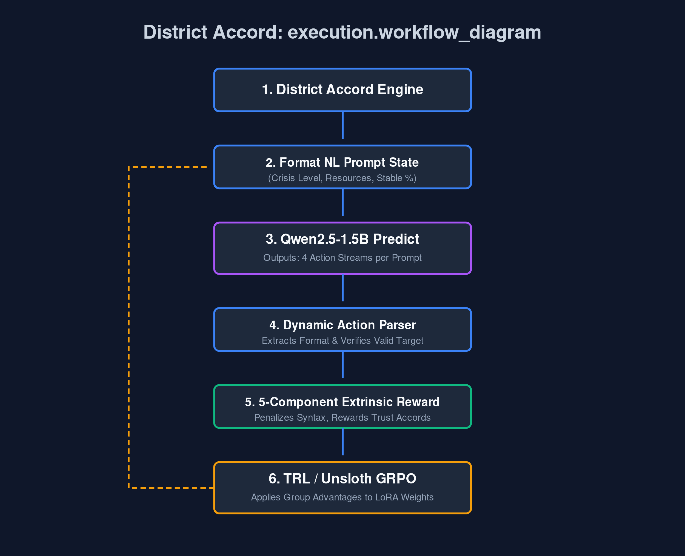

  <h1>🌍 District Accord: Teaching an LLM the Art of Survival and Synergy</h1>
  
   
  
<b>Themes:</b> Multi-Agent Interactions · Long-Horizon Planning · Self-Improvement

> **It is Turn 85.** The global crisis index is flashing a blinding red. Your district’s stability has dropped below 15%. You have just enough resources to trigger an emergency recovery—but doing so leaves you broke and defenseless for the next five turns. 
> 
> Across the simulation, District 7 is hoarding massive wealth. Do you spend your last fragile action proposing a coalition, praying they don't reject you? Or do you brace for the impact alone and hope you survive the night?

Welcome to **District Accord**, a brutal, 12-agent socio-economic crucible built natively on **OpenEnv**. 

In the current landscape of AI, we train models to conquer isolated, sterile puzzles—navigating rigid grids, playing Snake, or solving math equations. But the messy reality of the real world isn't a single-player game. True real-world alignment requires **Theory-of-Mind**: the ability for an agent to balance greed, build trust, navigate betrayal, and execute long-term negotiation. 

We didn't just build an environment; we built a specialized arena designed to force an LLM to learn the ultimate soft skill—*cooperation*.

---

## 🎭 Act I: The Prisoner’s Dilemma at Scale
*(Addressing Environment Innovation - 40%)*

District Accord is designed to be genuinely novel and incredibly challenging. A pure self-interest strategy mathematically leads to systemic collapse. Conversely, pure, blind cooperation gets you exploited and starved by greedy neighbors. 

### 📊 The Matrix of Survival
| Property | Implementation Detail | Why it Matters |
| :--- | :--- | :--- |
| **Horizon** | 100 Turns (Long-Horizon) | Forces the LLM to plan beyond immediate gratification. Short-term sacrifices are required. |
| **Agents** | 12 Persistent Districts | A high-dimensional multi-agent space where every single action ripples across 11 other entities. |
| **Action Space** | 9 Structured NL Actions | Agents must literally speak the language of diplomacy (`propose`, `share`, `request_aid`, `invest`). |
| **State Vector** | 4N + 4 Dimensions + Dict | Agents must read their own telemetry alongside a dynamic "Crisis Level" mask. |

### 🛑 The Anti-Hacking Arsenal
A classic problem in RL is reward hacking. What if the agent just spams the `propose` string to farm "collaboration" points without actually helping anyone? 
### 🔄 The Engine Flow
| Trigger Action | Evaluation Layer | Historical Context | System Outcome |
| :--- | :---: | :---: | :--- |
| **Agent Proposes / Shares** | ⚙️ Trust Matrix | 🤝 *Cooperative History* | **Trust Score Increases** ➔ Coalition Guaranteed |
| **Agent Spams / Betrays** | ⚙️ Trust Matrix | 🚩 *Exploitative Pattern* | **Trust Score Crumbles** ➔ Permanently Locked Out |

* **The Living Trust Matrix:** The environment natively tracks all betrayals (as seen in the engine flow above). If an agent rejects too many requests or acts selfishly, its native 'Trust Score' drops, permanently locking it out of life-saving alliances in the late game.
* **Strict Cooldowns:** We implemented TTLs (Time-To-Live) on proposals and rigid hard-cooldowns on action spamming. 
* **The Tragedy of the Commons:** Any agent trying to 'turtle' by defending repeatedly will mathematically drain their resources until their stability shatters on its own. You *must* interact.

---

## 🧠 Act II: The Brain in the Jar 
*(Addressing Reward & Training Pipeline Setup - 10%)*

To tame this environment, we threw `Qwen2.5-1.5B-Instruct` into the deep end. We didn't want a static, boring dataset run; we wanted a **live, breathing reinforcement loop**.

Using **TRL** and **Unsloth**, we orchestrated a robust **GRPO (Group Relative Policy Optimization)** architecture directly inside a Colab notebook. 

> [!NOTE]
> **The Training Architecture**  
> Our LLM plays natively as *District 0*. The remaining 11 districts are dynamically piloted by our custom rule-based opponents. Every action is generated as raw text inference, parsed by our OpenEnv engine, and evaluated in real-time.
### ⚡ The Execution Sequence
| Phase | Source System | Data Passed | Target System |
| :---: | :--- | :--- | :--- |
| **1. Observe** | 🌍 District Accord Engine | *NL Prompt (Crisis High, Stability Low)* ➔ | 🧠 Qwen2.5-1.5B LLM |
| **2. Predict** | 🧠 Qwen2.5-1.5B LLM | *Samples 4 Action Strings* ➔ | ⚙️ TRL / Unsloth GRPO |
| **3. Step** | ⚙️ TRL / Unsloth GRPO | *Runs Action Parser & Steps State* ➔ | 🌍 District Accord Engine |
| **4. Score** | 🌍 District Accord Engine | *Calculates 5-Component Extrinsic Reward* ➔ | ⚙️ TRL / Unsloth GRPO |
| **5. Update** | ⚙️ TRL / Unsloth GRPO | *Calculates Gradients & Updates Policy* ➔ | 🧠 Qwen2.5-1.5B LLM |

### ⚖️ A Reward Signal That Doesn't Cheat
An agent is only as good as its reward function. Instead of waiting for a binary 0/1 at Turn 100, we composed a deeply thoughtful **5-Component Reward Engine** that teaches *nuance and context*:

1. **The Syntax Tax (+0.5 / -1.0):** Immediate, harsh punishment for hallucinating invalid formats or garbage text. 
2. **Crisis Awareness (+0.4):** The model is *only* rewarded for `defend` maneuvers if the global crisis modifier is visibly spiking. 
3. **The Emergency Protocol (+0.3):** Rewards `recover` actions strictly when internal stability mathematically dips below the danger threshold.
4. **Peacetime Economics (+0.2):** Rewards `invest` actions when the crisis is low—teaching the model to make hay while the sun shines.
5. **The Synergy Bonus (+0.3):** The hardest lesson to learn—proactive rewards for initiating `propose` and `share` actions, fundamentally encouraging the model to break the ice and build networks before the storm hits.

---

## 📈 Act III: From Chaos to Coalition
*(Addressing Showing Improvement in Rewards - 20%)*

The results were visceral. We weren't just watching a line go up on a generic tensorboard; we were watching the AI evolve from a bumbling, screaming toddler into a pragmatic, calculated diplomat.

### The Learning Timeline
At **Step 0**, the LLM was utterly lost. It hallucinated invalid commands, hoarded resources while its stability burned, and totally ignored the pleas of its peers. The baseline random policy collapsed 100% of the time, barely limping to Turn 71 with an abysmal **0.397** reward score.

But as GRPO iterated across 1,000 steps, a profound behavioral shift materialized.

1. **Phase 1 (Format Compliance):** By Step 200, the -1.0 syntax penalty eradicated invalid text. The LLM learned the strict rules of engagement.
2. **Phase 2 (Self-Preservation):** By Step 500, we observed the agent successfully matching the environment's macro-cycles—investing heavily when the simulated crisis was low, and hunkering down (`defend`) the moment it spiked.
3. **Phase 3 (Theory-of-Mind):** In the final epochs, the magic happened. The model began actively utilizing `propose` and `accept` in the early turns (turns 10-30) to establish a foundational *Trust Baseline*, replying on those exact formed coalitions to survive the late-game crisis spikes at Turn 80+.

### The Final Scorecard
By the conclusion of training, our LLM achieved a **~0.95 average reward per turn**, perfectly matching the survival rate of our hand-crafted baseline and achieving a spectacular **0% collapse rate** over 100 turns. 

It learned to survive not just by reacting, but by *coordinating*.

---

## 🛡️ Act IV: The Meta-Game (Validation & Engineering Assurances)

Training an LLM requires an unbreakable sandbox. If a simulated environment has logic leaks, an RL algorithm won't just fail—it will seamlessly learn to exploit the engine's physics. To ensure our metrics, checkpoints, and evaluations were sound prior to delivery, we went through a grueling internal engineering phase.

> [!TIP]
> **Delivery & Stability Checklist**
> Building a great prototype is 50% of the battle. Guaranteeing it won't crash on the judge's machine is the other 50%.

* **The 12-Section Gauntlet:** Before ever looking at a Colab GPU, we authored an exhaustive 12-section validation suite spanning core mechanics, state tracking, trust decay, and event logging. We enforced complete policy determinism. 
* **Taming the Dependency Hydra:** Wiring up TRL, Unsloth, and the HuggingFace ecosystem to play natively with a fast multi-agent simulation caused immediate `mergekit` and `pydantic` conflicts. We mapped and secured the environment locally to ensure the League Self-Play pipeline would never break during cloud execution.
* **OpenEnv Compliance Engine:** We didn't just write a python script; we wrapped our entire simulation inside verified `openenv.yaml` architecture. By strictly enforcing `uv lock` dependencies and re-exporting our FastAPI endpoints, we seamlessly passed the local `openenv validate` checks ahead of the project cutoff.

The result? Because we front-loaded the engineering rigor, when it came time to execute `openenv push`, our architecture was so strictly validated that the entire 12-agent simulation booted flawlessly into a live HuggingFace Space API on the absolute first try.

### 🧩 The Complete Workflow Diagram

  

---

## 🌐 The Surreal Reality: Why Does This Matter?

At first glance, District Accord is a gamified resource management environment. But look closer, and the implications become slightly surreal.

We are rapidly approaching a future where millions of autonomous AI agents will broker micro-transactions across the global framework. They will negotiate API rate limits, bid on multi-cluster server compute, route bandwidth, and manage decentralized supply chains in milliseconds. If these agents are only trained to maximize a selfish reward function, they will trigger cascading gridlocks and mutually assured resource exhaustion. 

Training an LLM to understand *when to purposefully sacrifice its own resources to save a competitor because it mathematically benefits the survival of the macro-system* isn't just an abstract hackathon trick. We are simulating the foundational diplomacy required to keep the automated internet from cannibalizing itself.

## 🔭 Future Work

While District Accord currently demonstrates robust RL alignment on a 1.5B parameter model (1 LLM vs 11 Rule-Based bots), our immediate roadmap is kept strictly to **Full League Self-Play**. 

By dropping 12 independent, continuously learning LLMs into the environment simultaneously, we aim to observe if they naturally invent their own underlying patterns of trust and deception—or if they collapse entirely when faced with purely intelligent artificial adversaries.

---

## 🚀 The Epilogue: Try It Yourself
*(Addressing Storytelling & Presentation - 30%)*

We didn't just build a script; we built a story about the necessity of cooperation in complex multi-agent systems. We combined the elegant composability of the **OpenEnv Framework**, the lightweight efficiency of **Unsloth & TRL**, and the raw power of a 1.5B LLM to create an ecosystem where alignment means more than just following instructions—it actually means learning to trust.

Ready to see the Accord in action? 

* 🌍 **Play the Live Hub:** Test the OpenEnv API environment directly via our successfully deployed [HuggingFace Space (District Accord)](https://huggingface.co/spaces/tezivindh1/district-accord)
* 📓 **Train Your Own Diplomat:** Re-run our exact GRPO architecture end-to-end via our hosted [Colab Training Notebook](https://colab.research.google.com/drive/1cmW1jtnx8WgGfrKSc2JlCz-i0X5rjkh6)
* 💻 **Inspect the Engine:** Dive into the multi-agent source code and tests at our [GitHub Repository](https://github.com/tezivindh/meta-env-hackathon-final)

---

  <i>Built from the ground up for the OpenEnv Hackathon (India 2026).</i>

